# Kubernetes Kurulumu

Bu dokümanda RKE2 ile kubernetes kurulumu ve sonrasında da cluster'ımızı yönetmek için rancher kurulumunu yapacağız.

## 1. Serverlar ve Kullanıcı tanımları

## 1.1 Serverların hazırlanması
Aşağıdaki linux makineler hazır olmalıdır. Basit bir kubernetes ortamı ayağa kaldırmak istiyoruz. Bu nedenle her bir makinenin 4 core , 8GB RAM ve en az 60GB disk alanı olacak şekilde ayarlıyoruz.


| name | core | memory | ip | disk | os |
|---| --- | --- | --- | --- | --- |
|pi-k8s-master | 4 | 8Gi | 192.168.199.30 | 60 | Ubuntu 22.04 x64 |
|pi-k8s-worker1 | 4 | 8Gi | 192.168.199.31 | 60 | Ubuntu 22.04 x64 |
|pi-k8s-worker2 | 4 | 8Gi | 192.168.199.32 | 60 | Ubuntu 22.04 x64 |

Kubernetes ortamı için hazırladığımız bu makinelerden bir tanesini kubernetesin yönetimi için seçiyoruz. Buradaki örneğimizde **pi-k8s-master** isimli makineyi bu görev için kullanacağız

Aşağıdaki komutları üç makinede de çalıştırıyoruz.

```bash
# root kullanıcına geçilir
sudo su -

# stop the software firewall
systemctl disable --now ufw

# get updates, install nfs, and apply
apt update
apt install nfs-common -y  
apt upgrade -y

# clean up
apt autoremove -y
```

## 2. RKE2 Kurulumu


RKE2 kurulumunu master olarak seçtiğimiz **pi-k8s-master** makinesine yapacağız.

```bash
# On pi-k8s-master

#root kullanıcısına geçilir
$ sudo su -

$ curl -sfL https://get.rke2.io | INSTALL_RKE2_TYPE=server sh - 

# we can set the token - create config dir/file
$ mkdir -p /etc/rancher/rke2/ 

$ echo "token: bootstrapAllTheThings" > /etc/rancher/rke2/config.yaml

# start and enable for restarts - 
$ systemctl enable --now rke2-server.service
```
kurulum tamamlandığında aşağıdaki gibi görüntü olacaktır. İşlem biraz uzun sürebilir.

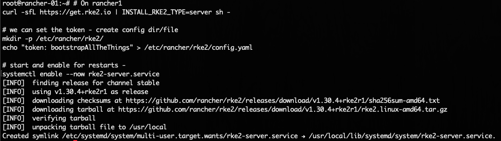

`systemctl status rke2-server` komutunu çalıştırarak, statunun `active` olduğunda emin oluyoruz.

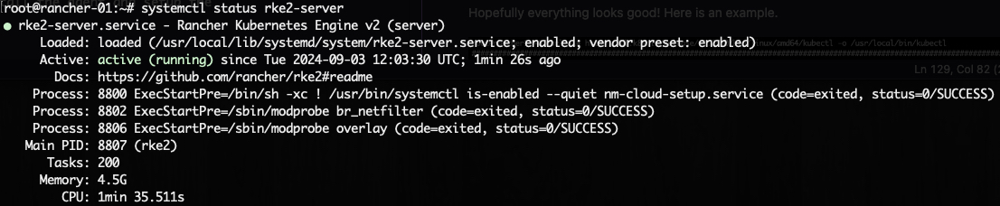

Artık kubernetes'den bahsetmeye başlayabiliriz. Öncelikle RKE2 nin kurulu olduğu `pi-k8s-master` makinesinde `kubectl` için symlink oluşturmalıyız.

```bash
# symlink all the things - kubectl
$ ln -s $(find /var/lib/rancher/rke2/data/ -name kubectl) /usr/local/bin/kubectl

# add kubectl conf with persistence, as per Duane
$ echo "export KUBECONFIG=/etc/rancher/rke2/rke2.yaml PATH=$PATH:/usr/local/bin/:/var/lib/rancher/rke2/bin/" >> ~/.bashrc

$ source ~/.bashrc

# check node status
$ kubectl get node
```

Eğer herşey yolunda gittiyse aşağıdaki gibi bir görüntü olacaktır.

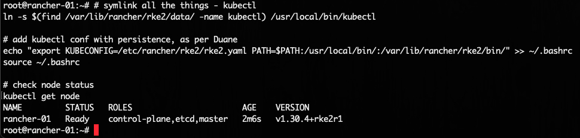

For those that are not TOO familiar with k8s, the config file is what `kubectl` uses to authenticate to the api service. If you want to use a workstation, jump box, or any other machine you will want to copy `/etc/rancher/rke2/rke2.yaml`. You will want to modify the file to change the ip address. 

 `kubectl` in kullandığı authenticate ayarlarının olduğu config dosyasına `/etc/rancher/rke2/rke2.yaml` dan erişebilirsiniz.


## 3. RKE2 Agent kurulumu

agent kurulumun master node haricindeki makinelerede yani worker nodelarımız olan **pi-k8s-worker1**, **pi-k8s-worker2** makinelerinde yapacağız.

```bash
#root kullanıcısına geçilir
$ sudo su -

# we can export the pi-k8s-master IP from the first server.
$ export RANCHER1_IP=192.168.199.30   # <-- change this!

# we add INSTALL_RKE2_TYPE=agent
$ curl -sfL https://get.rke2.io | INSTALL_RKE2_TYPE=agent sh -  

# create config dir/file
$ mkdir -p /etc/rancher/rke2/ 

# change the ip to reflect your pi-k8s-master ip
$ cat << EOF >> /etc/rancher/rke2/config.yaml
server: https://$RANCHER1_IP:9345
token: bootstrapAllTheThings
EOF

# enable and start
systemctl enable --now rke2-agent.service
```

Ekran görüntüsü böyle olacaktır.

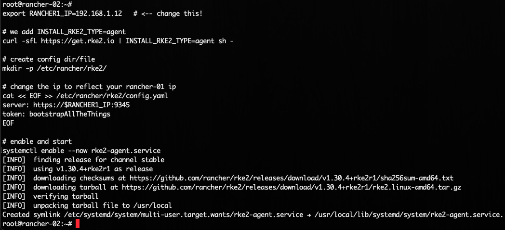

**pi-k8s-worker1**, **pi-k8s-worker2**  makinelerinde tüm işlemleri tamamladıktan sonra, `pi-k8s-master` makinemizde `kubectl get node -o wide` komutunu çalıştırarak worker nodelarımızın başarılı bir şekilde ayarlandığını kontrol ediyoruz. İşlemler biraz uzun sürebilir.

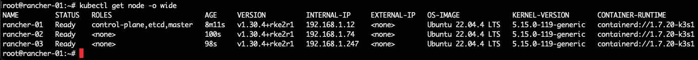

RKE2 ile kubernetes kurulumu adımların tamamlamış oldu :). Sırada rancher kurulumu var.

## 4. Rancher kurulumu

Rancher kurulumunu **helm** 'e ile yapacağız. Rancher kurulumunda SSL sertifikasına ihtiyacımız vardır. Kendi ürettiğimiz selfsigned sertifika ile SSL ihtiyacımızı çözeceğiz. İşlemlerimize pi-k8s-master makinesinde aşağıdaki komutları çalıştırarak devam ediyoruz.


## 4.1 sertifika üretimi

Öncelikle selfsigned sertifikamızı üretiyoruz. Bu sertifika ile rancher kurulumunu yapacağız.

```shell
$ mkdir rancher-certs && cd rancher-certs

$ apt install openssl

$ openssl genrsa -out ca-rancher.key 4096

$ openssl req -x509 -new -nodes -sha512 -days 3650 -subj "/C=CN/ST=Istanbul/L=Istanbul/O=devops/OU=Personal/CN=rancher.prometyum.net" -key ca-rancher.key -out ca-rancher.crt

$ openssl genrsa -out rancher.prometyum.net.key 4096

$ openssl req -sha512 -new -subj "/C=CN/ST=Istanbul/L=Istanbul/O=devops/OU=Personal/CN=rancher.prometyum.net" -key rancher.prometyum.net.key -out rancher.prometyum.net.csr

$ cat > v3.ext << EOF
authorityKeyIdentifier=keyid,issuer
basicConstraints=CA:FALSE
keyUsage = digitalSignature, nonRepudiation, keyEncipherment, dataEncipherment
extendedKeyUsage = serverAuth
subjectAltName = @alt_names

[alt_names]
DNS.1=rancher.prometyum.net
DNS.2=rancher.prometyum
DNS.3=rancher
EOF

$ openssl x509 -req -sha512 -days 3650 -extfile v3.ext -CA ca-rancher.crt -CAkey ca-rancher.key -CAcreateserial -in rancher.prometyum.net.csr -out rancher.prometyum.net.crt

$ openssl x509 -inform PEM -in rancher.prometyum.net.crt -out rancher.prometyum.net.cert

$ openssl x509 -inform PEM -in ca-rancher.crt -out ca-rancher.cert

# important! filename must be cacerts.pem
$ openssl x509 -inform PEM -in ca-rancher.crt -out cacerts.pem
```

---

## 4.2 ubuntuda kök sertifikaların tanılması

*Bu işlemler pi-k8s-master makinesinde yapılacaktır*

```shell
$ apt-get install -y ca-certificates

$ cp ca-rancher.crt /usr/local/share/ca-certificates

$ update-ca-certificates
```

## 4.3 helm kurulumu

Rancher kurulumu için **helm** 'e ihtiyacımız vardır. Öncelikle **helm** kurulumunu ile başlıyoruz. İşlemlerimize pi-k8s-master makinesinde aşağıdaki komutları çalıştırarak devam ediyoruz.

```bash
# on the server pi-k8s-master
# add helm
curl -#L https://raw.githubusercontent.com/helm/helm/main/scripts/get-helm-3 | bash

# add needed helm charts
helm repo add rancher-latest https://releases.rancher.com/server-charts/latest --force-update

helm repo add jetstack https://charts.jetstack.io --force-update
```


## 4.4 rancher kurulumu

```bash
# pi-k8s-master makinesinde sertifikaları /etc/rancher/certs klasörüne kopyalıyoruz
mkdir /etc/rancher/certs/
cp rancher.prometyum.net.key /etc/rancher/certs/
cp rancher.prometyum.net.crt /etc/rancher/certs/

# helm install jetstack
helm upgrade -i cert-manager jetstack/cert-manager -n cert-manager --create-namespace --set crds.enabled=true

# helm install rancher
kubectl create ns cattle-system

kubectl -n cattle-system create secret tls tls-rancher-ingress --cert=/etc/rancher/certs/rancher.prometyum.net.crt --key=/etc/rancher/certs/rancher.prometyum.net.key

kubectl -n cattle-system create secret generic tls-ca --from-file=cacerts.pem 

helm upgrade -i rancher rancher-latest/rancher -n cattle-system --create-namespace --set hostname=rancher.prometyum.net --set bootstrapPassword=bootStrapAllTheThings --set replicas=1 --set ingress.tls.source=secret --set ingress.tls.secretName=tls-rancher-ingress --set privateCA=true 

```

Tüm kurulumların başarılı birşekilde tamamlandığını kontrol etmek için `kubectl get pod -n cattle-system` komutu çalıştırılır.Ayrıca rancher arayüzünün açılması bir kaç dakika sürebilir aklınızda olsun ;)

## 5 rancher arayüzü
Tarayıcınızdan "rancher.prometyum.net" adresini yazara gidebilirsiniz fakat öncesinde host dosyanızda ip tanımlamasını yapmasını unutmamalıyız.

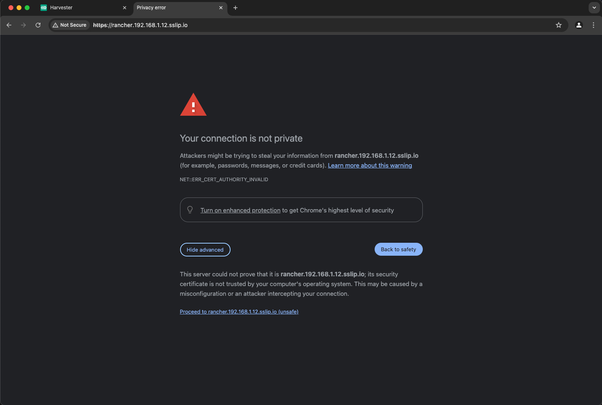
Rancher kurulumunda belirtiğimiz şifre `bootStrapAllTheThings` ile giriş yapabiliriz.

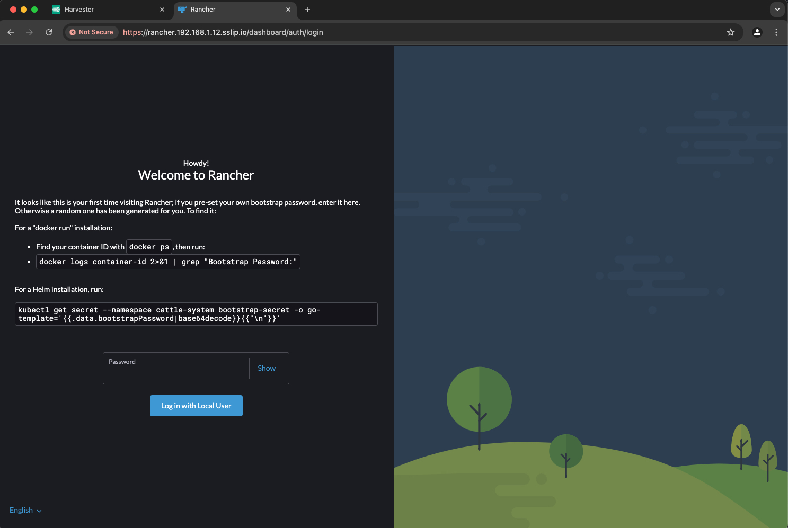

Server url sini doğrulamanız ve kabul etmeniz gerekmektedir.

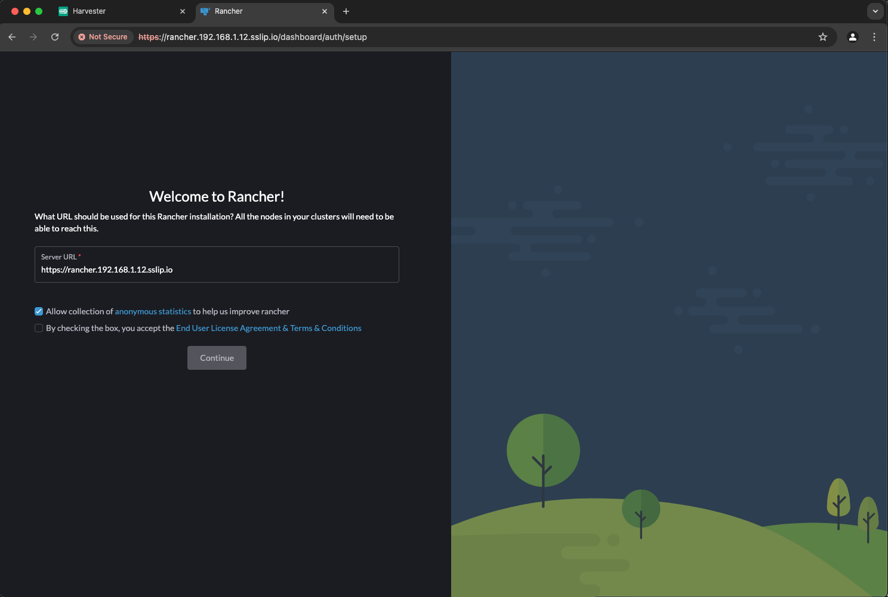

Ve sonunda rancher karşılama ekranı açılmış oldu :)

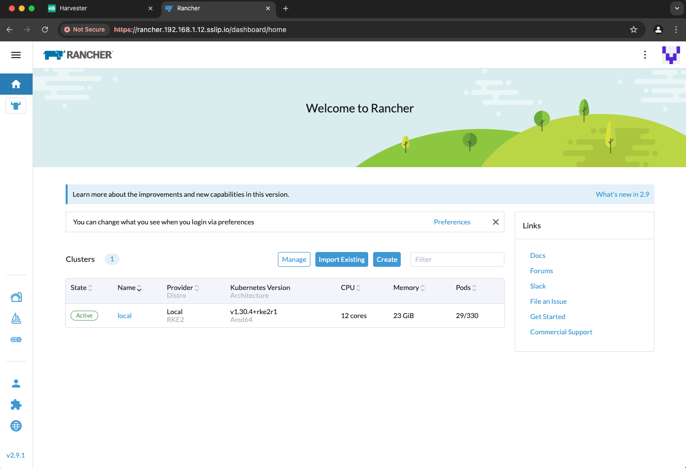

**NOT:rancher' a giriş yaptıktan sonra admin şifresini değiştirmek unutulmamalıdır.** 


## 6 Longhorn
## 6.1 Longhorn kurulumu

**helm** ile longhorn kurulumunu yapacağız

```bash
# get charts
helm repo add longhorn https://charts.longhorn.io --force-update

# install
helm upgrade -i longhorn longhorn/longhorn --namespace longhorn-system --create-namespace

# podlarımızın ayağa kalktığını kontrol ediyoruz
kubectl get pods -n longhorn-system
```

`kubectl get sc` komutu ile storage class' larını listeleye biliriz

```text
root@pi-k8s-master:~# kubectl  get sc
NAME                 PROVISIONER          RECLAIMPOLICY   VOLUMEBINDINGMODE   ALLOWVOLUMEEXPANSION   AGE
longhorn (default)   driver.longhorn.io   Delete          Immediate           true                   3m58s
```

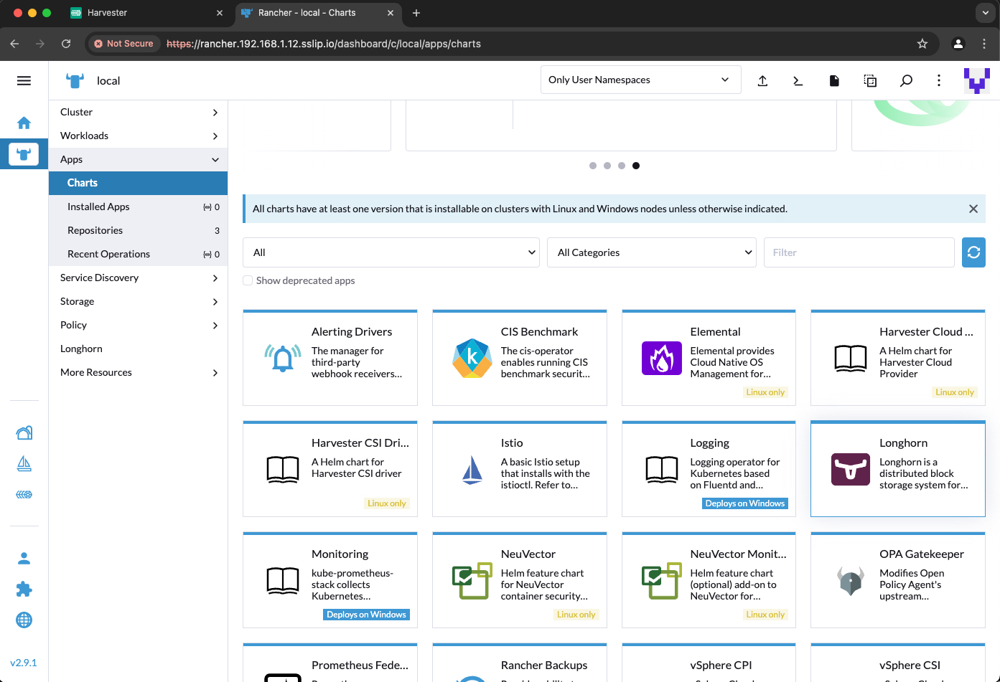

## 6.2 Longhorn arayüzü

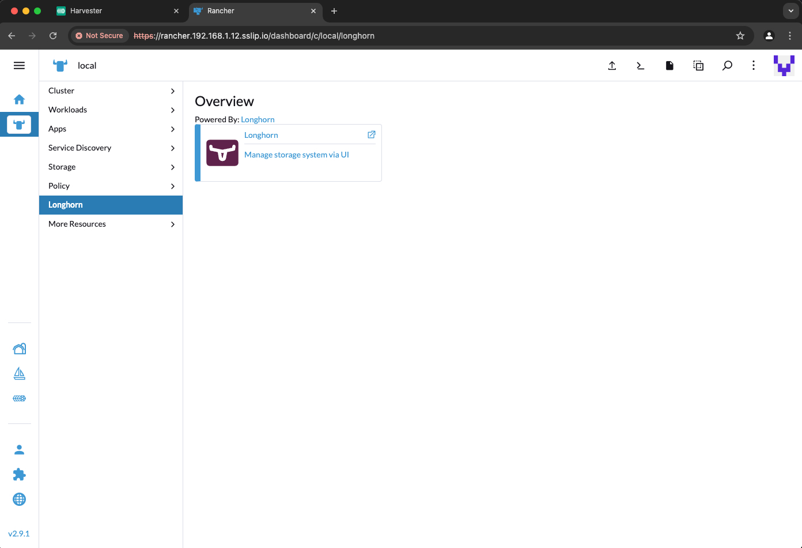

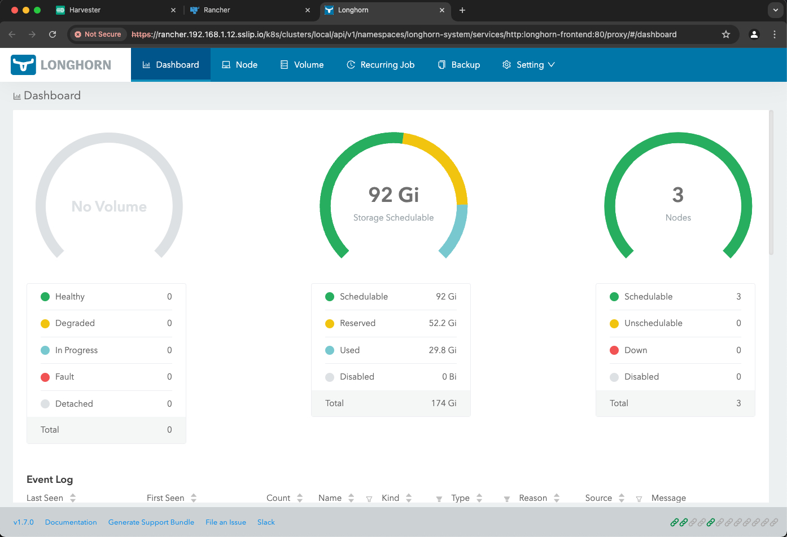


## 8 NeuVector Kurulumu
**helm** ile NeuVector kurulumunu yapacağız.


## 8.1 sertifika üretimi

Öncelikle selfsigned sertifikamızı üretiyoruz. Bu sertifika ile neuvector kurulumunu yapacağız.

```shell
$ mkdir neuvector-certs && cd neuvector-certs

$ apt install openssl

$ openssl genrsa -out ca-neuvector.key 4096

$ openssl req -x509 -new -nodes -sha512 -days 3650 -subj "/C=CN/ST=Istanbul/L=Istanbul/O=devops/OU=Personal/CN=neuvector.prometyum.net" -key ca-neuvector.key -out ca-neuvector.crt

$ openssl genrsa -out neuvector.prometyum.net.key 4096

$ openssl req -sha512 -new -subj "/C=CN/ST=Istanbul/L=Istanbul/O=devops/OU=Personal/CN=neuvector.prometyum.net" -key neuvector.prometyum.net.key -out neuvector.prometyum.net.csr

$ cat > v3.ext << EOF
authorityKeyIdentifier=keyid,issuer
basicConstraints=CA:FALSE
keyUsage = digitalSignature, nonRepudiation, keyEncipherment, dataEncipherment
extendedKeyUsage = serverAuth
subjectAltName = @alt_names

[alt_names]
DNS.1=neuvector.prometyum.net
DNS.2=neuvector.prometyum
DNS.3=neuvector
EOF

$ openssl x509 -req -sha512 -days 3650 -extfile v3.ext -CA ca-neuvector.crt -CAkey ca-neuvector.key -CAcreateserial -in neuvector.prometyum.net.csr -out neuvector.prometyum.net.crt

$ openssl x509 -inform PEM -in neuvector.prometyum.net.crt -out neuvector.prometyum.net.cert

$ openssl x509 -inform PEM -in ca-neuvector.crt -out ca-neuvector.cert

# important! filename must be cacerts.pem
$ openssl x509 -inform PEM -in ca-neuvector.crt -out cacerts.pem
```

---

## 8.2 ubuntuda kök sertifikaların tanılması

*Bu işlemler pi-k8s-master makinesinde yapılacaktır*

```shell
$ apt-get install -y ca-certificates

$ cp ca-neuvector.crt /usr/local/share/ca-certificates

$ update-ca-certificates
```


## 8.3 neuvector kurulumu
```bash

# helm repo add
helm repo add neuvector https://neuvector.github.io/neuvector-helm/ --force-update

# helm install 

kubectl create ns cattle-neuvector-system

kubectl -n cattle-neuvector-system create secret tls neuvector-tls-secret --cert=neuvector.prometyum.net.crt --key=neuvector.prometyum.net.key

helm upgrade -i neuvector -n cattle-neuvector-system neuvector/core --create-namespace --set manager.svc.type=ClusterIP --set controller.pvc.enabled=true --set controller.pvc.capacity=500Mi --set manager.ingress.enabled=true --set manager.ingress.host=neuvector.prometyum.net --set manager.ingress.tls=true --set controller.service.tlsSecret=neuvector-tls-secret --set manager.service.tlsSecret=neuvector-tls-secret --set manager.ingress.secretName=neuvector-tls-secret


# add for single sign-on
# --set controller.ranchersso.enabled=true --set global.cattle.url=https://neuvector.prometyum.net
```

Şimdi pod ları kontrol edelim.

```bash
kubectl get pod -n cattle-neuvector-system
```

Bu işlem biraz uzun sürecektir. Tüm podların running statüsüne geldiğinden emin olalım.

```text
root@pi-k8s-master:~# kubectl get pod -n cattle-neuvector-system
NAME                                        READY   STATUS    RESTARTS   AGE
neuvector-controller-pod-657599c5fd-2zfhh   1/1     Running   0          109s
neuvector-controller-pod-657599c5fd-qd2jx   1/1     Running   0          109s
neuvector-controller-pod-657599c5fd-qv5nv   1/1     Running   0          109s
neuvector-enforcer-pod-2dczs                1/1     Running   0          109s
neuvector-enforcer-pod-47r2q                1/1     Running   0          109s
neuvector-enforcer-pod-bg7rd                1/1     Running   0          109s
neuvector-manager-pod-66cfdb8779-f8qtj      1/1     Running   0          109s
neuvector-scanner-pod-fc48d77fc-b8hb9       1/1     Running   0          109s
neuvector-scanner-pod-fc48d77fc-h8lwd       1/1     Running   0          109s
neuvector-scanner-pod-fc48d77fc-mmmpx       1/1     Running   0          109s
```

Hadi arayüzü inceleyelim

Neuvector arayüzüne **https://neuvector.prometyum.net** adresinde girilir. kullanıcı adı : admin ve parola : admin bilgileri ile giriş yapılır.

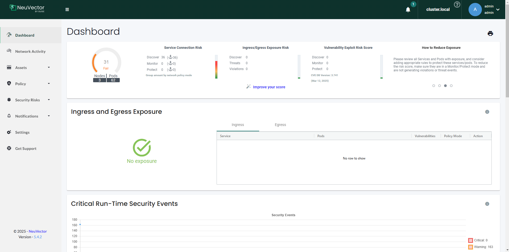

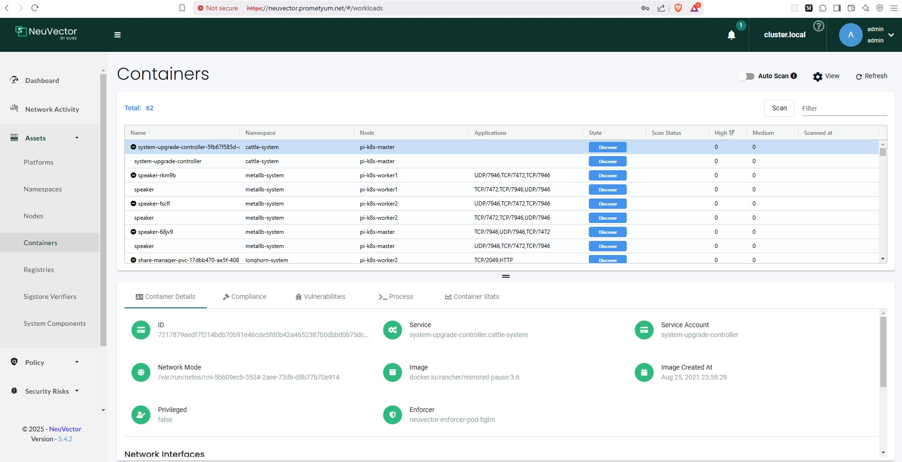


Kurulumlarınımı tamamlamış olduk :D

## Extra

rancher bootstrap şifresi unutulduğunda tekrardan rancher şifresini bulmak için aşağıdaki komut kullanılabilir

```
kubectl get secret --namespace cattle-system bootstrap-secret -o go-template='{{.data.bootstrapPassword|base64decode}}{{ "\n" }}'
```


rancher admin şifresini unuttuğumuzsa aşağıdaki adımları uygulayarak şifre değiştirilebilir
```bash
$ kubectl -n cattle-system exec -it <rancher_pd_name> -- bash

$ reset-passsword
```

kubernetes secret tanımlarını güncellemek için aşağıdaki komutlar kullanılabilir

```bash

## https://ranchermanager.docs.rancher.com/getting-started/installation-and-upgrade/resources/update-rancher-certificate
kubectl -n cattle-system create secret tls tls-rancher-ingress  --cert=/etc/rancher/certs/rancher.prometyum.net.crt  --key=/etc/rancher/certs/rancher.prometyum.net.key  --dry-run --save-config -o yaml | kubectl apply -f -

kubectl -n cattle-system create secret generic tls-ca --from-file=/etc/rancher/certs/ca-rancher.crt  --dry-run --save-config -o yaml | kubectl apply -f -

kubectl rollout restart deploy/rancher -n cattle-system
```

```bash
# rancherı silmek komutları
helm uninstall rancher -n cattle-system
kubectl delete namespace cattle-system
rm -rf /etc/rancher
```

## Kaynaklar

[https://www.youtube.com/watch?v=ONes6pv_9J4](https://www.youtube.com/watch?v=ONes6pv_9J4)

[https://github.com/clemenko/rke_install_blog?tab=readme-ov-file#rke2-server-install](https://github.com/clemenko/rke_install_blog?tab=readme-ov-file#rke2-server-install)

[https://gist.github.com/clemenko/251a90a28e6a8bbc8be9427480babb3a](https://gist.github.com/clemenko/251a90a28e6a8bbc8be9427480babb3a)

[https://ranchermanager.docs.rancher.com/getting-started/installation-and-upgrade/resources/update-rancher-certificate#2-createupdate-the-ca-certificate-secret-object](https://ranchermanager.docs.rancher.com/getting-started/installation-and-upgrade/resources/update-rancher-certificate#2-createupdate-the-ca-certificate-secret-object)

[https://ranchermanager.docs.rancher.com/getting-started/installation-and-upgrade/resources/add-tls-secrets](https://ranchermanager.docs.rancher.com/getting-started/installation-and-upgrade/resources/add-tls-secrets)
